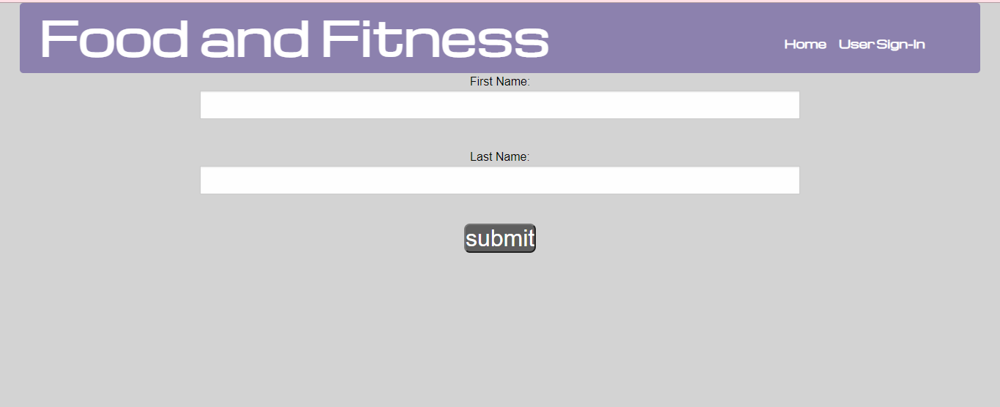

# **food-and-fitness-tracker**
Web Application created by:

Sebastian Fav&egrave;\
Andre Lucas\
Jada Desormeaux

&nbsp;
## **[Live Application](https://spfave.github.io/fitness-exercise-food-selector/)**

&nbsp;
## **App Description**
### Our Task:

We created a simple application that allows the user to choose and track their daily workouts and daily food intake. Our web application will have the user login and choose what area of the body they want to focus on and a list of exercises will be displayed to them and they will be able to choose which ones to do for that day. After the exercises they then will be asked what kind of meal they want and a recipe list matching those needs will appear. Once exercise or food is chosen, those items will be saved in local stoarge and they will be able to access their recent choices byt clicking on the 'history' button. 

### User Story:

AS A fitness enthusiast \
I WANT to be able to choose what part of the body to focus on, be able to find recipes, and save those inputs to be able to go back and see them \
SO THAT I am targeting all areas and keeping my diet clean

&nbsp;
## Screenshots of our Web Application:

&nbsp;
## **Technologies and Services**
Web Technologies
- HTML5, CSS, and JavaScript
- Local Storage
- AJAX using promises and async/await

External Frameworks and Services
- [Foundation](https://get.foundation/index.html)
- [jQuery](https://jquery.com/) 
- [Moment.js](https://momentjs.com/)
- [Workout API](https://wger.de/en/software/api)
- [Food API](https://www.edamam.com/)